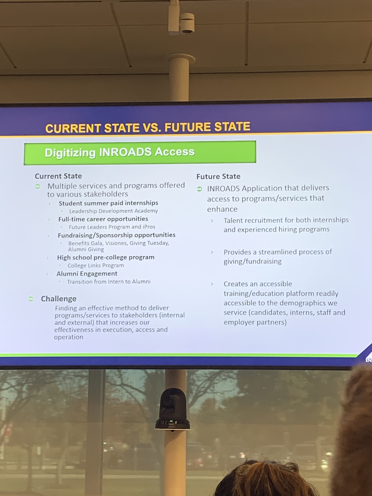

# Team 3

## Apprisen

- [https://www.apprisen.com/](Apprisen) - Building Financial Health

Meets 1 on 1 with people struggling financially

Debt management program

Works directly with creditors to alleviate debt

Offer services like 1+ year of financial counseling (buying car, house, retirement fund, student loans, etc.)

Want to help individuals avoid predatory lending practices (payday loans) (Quantifying how predatory a loan is?)

Can work with 3-5 years to work towards completing a debt management plan

[Apprisen Blog](https://www.apprisen.com/about-apprisen/media-center/the-money-minute)

Connecting with clients everyday

How can apprisen help debt management program participants successfully gradudate from the program at a higher rate?

-> We noticed that you missed your payment... how can we help?

  

## INROADS

5 Buttons with links to do whats in the powerpoint

Donation tab -> submit donation through stripe

-> Triggers Facebook messenger communication

How would you prioritize the functionality in the powerpoint?

  

Leadership development

Apply as a student
See offerings as a company

A client (student or corporate partner) can go and select a date time available, and we will get back to them with a confirmation

They are losing business because someone is not available to answer the client

Have to complete an application, submit resume, 2 hour interview, 

Application
2 hour training section (candidate prep)
video mock interview
approved resume -> Maybe autofills out resume given inputted text?

Student goes through process and is given a time to go to the career prep session

Students
Alumni
Corporate Clients

Alumni are able to volunteer, live mock interviews, summer training series, giving, 

Would click Alumni engagement -> Volunteering, giving, learning and development, board representation, starting up a local chapter.  You are given lifetime access to other job opportunities as an alumni

How do you collect resumes?  Where do they get sent?

Goes into something called simplicity -> for mock interviews

sugarcrm as a content management system

### Problems

Student perspective

We want to move them through the process more readily (without following up)

Corporate Clients

We want them to go to the app and view resumes of students.  Sort by major with 3.5 and above in certain geographic locaition -> major, gpa, location, year in school

Give evaluations, return offers, amount of internships, etc.

blue gold and green company colors

Having reactive design for recruiter & client

Shared mailbox?

Have a way to do phone calls through the app? -> Setup a google hangouts?

Messaging feature within -> a manager can send a request like:

"It's time to schedule a touchpoint for this month" -> You should pick a time for this day

Should go through the database

Student -> Upload resume and transcript -> home address, email, phone, gender, work authorization

It's stored as a file -> maybe some way to parse resumes that are custom uploaded